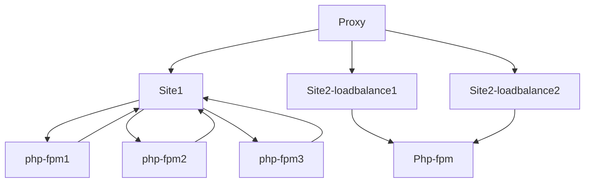

# nginx-php-fpm-loadbalance

```mermaid
  graph TD;
      Proxy-->Site1;
      Proxy-->Site2-loadbalance1;
      Proxy-->Site2-loadbalance2;
      Site1-->php-fpm1;
      Site1-->php-fpm2;
      Site1-->php-fpm3;
      php-fpm1-->Site1;
      php-fpm2-->Site1;
      php-fpm3-->Site1;
      Site2-loadbalance1-->Php-fpm;
      Site2-loadbalance2-->Php-fpm;
```

